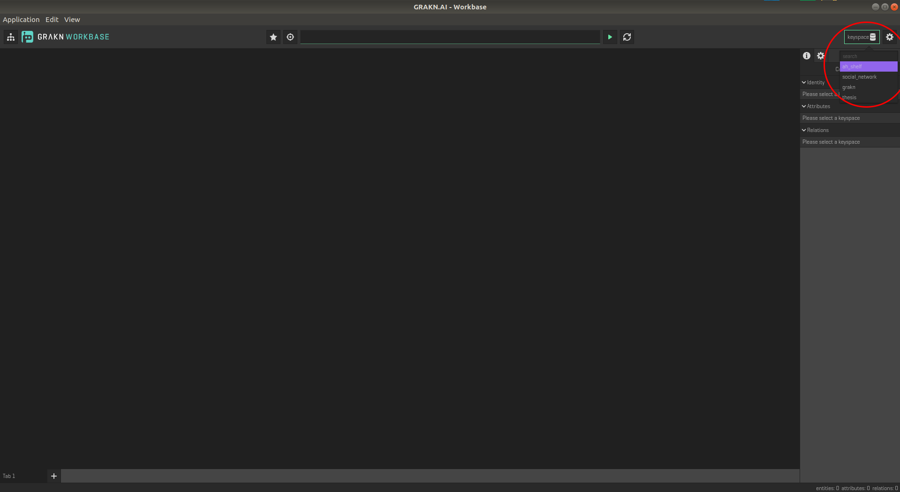
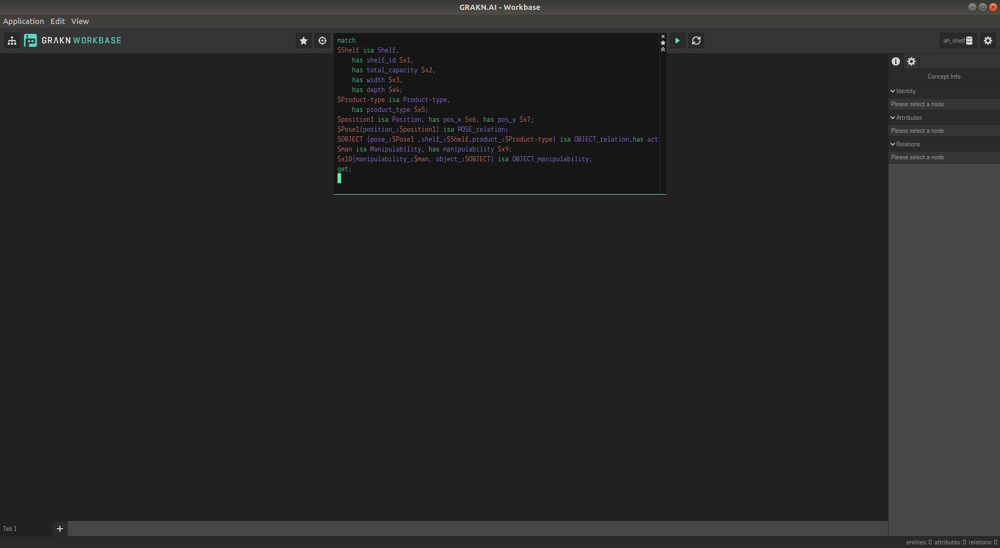
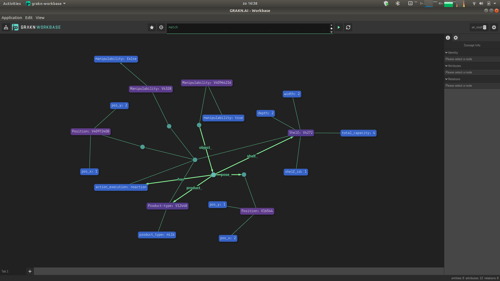
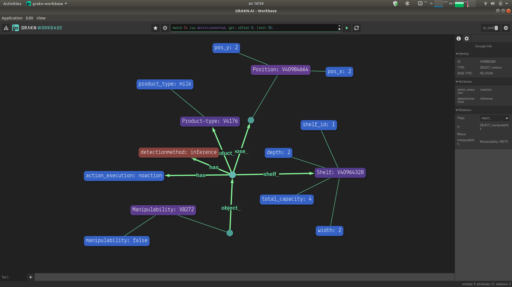

# Storeshelf_state estimation using GRAKN AI
This is an example of shelf state estimation in ROS using reasoning over the available knowledge. GRAKN.AI is used for Knowledge base and semantic modelling.

# Scenario
A store has multiple shelves with width, depth, capacity and ID, state. Assume we have shelf as shown in the diagram with 2 block width and 2 block depth. The store has different types of products such as milk, yoghurt, cookies and each product type has different size. The initial state of the shelf can be unknown. We want to accurately estimate the state of the shelf. For doing this we are going to use semantic knowledge representation and reasoning. The complete scenario is given in [here](https://docs.google.com/document/d/1aN9yfv51_fry0pkJrIdyWjGWxzjqQhxPJ6Wc-JbfkZQ/edit?usp=sharing)

# Dependency

1. Java 8
```
sudo apt-get install openjdk-8-jre
```
2. [Grakn Core](https://grakn.ai/download#core) for knowledge representation and reasoning (Tested with Core 1.8.2)

3. [Grakn Workbase](https://github.com/graknlabs/workbase/releases/tag/1.3.5) for visualisation (Tested with Core 1.3.5)

# Use

1. Download and unzip Grakn Core and Grakn Workbase and paste it in any folder of your choice

2. Clone this repository 
```
$ mkdir -p ~/AH_shelf_grakn/src
$ cd ~/AH_shelf_grakn/src
$ catkin_init_workspace
$ git clone https://github.com/shreyashpalande/Storeshelf_estimation_GraknAI.git
$ cd ~/AH_shelf_grakn
$ catkin build
$ source devel/setup.bash
```

3. Start the grakn core by going to the base folder which contains grakn core and type
```
$ sudo ./grakn server start
```

4. Upload the schema to grakn server
```
$ ./grakn console -k ah_shelf -f ~/AH_shelf_grakn/src/Storeshelf_estimation_GraknAI/grakn_KB/schema.gql
```
5. For visualization open grakn workbase 
```
$ ./grakn-workbase
```
Select the **ah_shelf** keyspace as shown in the figure



6. Start the roscore 

```
$ roscore
```
7. In second terminal start the client server
```
$ rosrun graknrosservice graknrosserver.py
```
If everything is working correctly you wil get the output 
```
[INFO] [1601212890.324526]: World state Initialised...
[INFO] [1601212890.325655]: Action server started...
```

8. We need to observe the shelf and update the observed objects in the KB
```
$ rosservice call /grakn_ros "query_type: 'observeshelf'" 
```
9. To visualize the status of semantic world model refresh the workbase by typing **Ctrl+R**. Repeat the step 5. and copy past the below query in the query block as shown in the figure
```
match 
$Shelf isa Shelf, has shelf_id $x1, has total_capacity $x2, has width $x3, has depth $x4;
$Product-type isa Product-type, has product_type $x5;
$position1 isa Position, has pos_x $x6, has pos_y $x7;
$Pose1(position_:$position1) isa POSE_relation;
$OBJECT (pose_:$Pose1 ,shelf_:$Shelf,product_:$Product-type) isa OBJECT_relation, has detectionmethod $x8, has action_execution $x9;
$man isa Manipulability, has manipulability $x10;
$x11(manipulability_:$man, object_:$OBJECT) isa OBJECT_manipulability;
get;
```



You will get the following response



10. The next step is to perform action of pushing on the object which are manipulable. This can be done by calling a ros service to perform action
```
$ rosservice call /grakn_ros "query_type: 'executeaction'"
```

11. If the action fails as was in our case there are hidden states present in the world belief. We need to update those hidden states in the semantic model. This should be triggered based on the response of the action executed but for clear understanding we are doing it seperately by calling a ros service to update the hidden states
```
$ rosservice call /grakn_ros "query_type: 'searchhiddenstates'"
```
This will seach and update hidden states in the world belief and will give add a object behind the manipulated object behind the manipulated object and its detection method is inference as it is not directly visible.



## TODO
